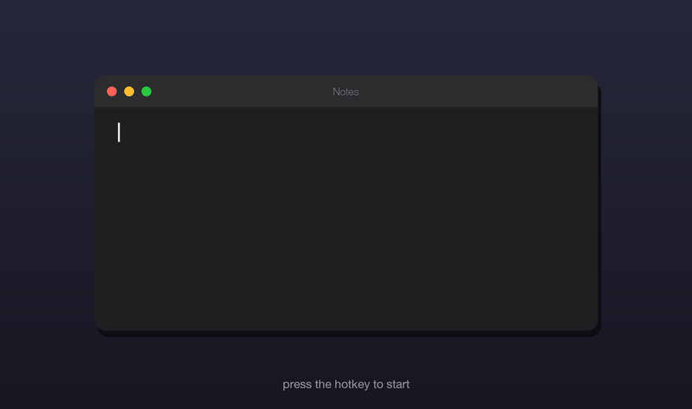

# Lori — voice input for macOS


Press a button — speak — press again. Text is pasted wherever your cursor is.



**Transcription is fully local.** Nothing leaves your machine. No API key needed.

---

## What it does

- Records audio from your microphone
- Transcribes using [mlx-whisper](https://github.com/ml-explore/mlx-examples/tree/main/whisper) (model `mlx-community/whisper-medium-mlx`) — Whisper medium accelerated on Apple Neural Engine via MLX
- Pastes text via clipboard (⌘V) into any application — your previous clipboard content is restored after pasting
- Runs in the background, starts automatically at login
- Privacy-minded: transcripts are never written to the log (only their length), trigger/lock files live in a private per-user directory (`~/Library/Application Support/lori/`, mode 0700), recording auto-stops after 10 minutes if you forget it

**Requirements:** macOS 13+ (Apple Silicon runs on Neural Engine; Intel will be noticeably slower), Python 3.11–3.13 (recommended: install from [python.org](https://python.org/downloads/)), ~1.5 GB free disk space (mlx-whisper medium model, cached once).

---

## Installation

```bash
git clone https://github.com/Ri-Ri-Ri/lori.git
cd lori
bash install.sh
```

The script will:
- find Python
- install dependencies (Python packages including `mlx-whisper`)
- create a launchd agent (auto-start)

The mlx-whisper medium model (~1.4 GB) downloads automatically on first run and is cached locally — only once.

After installation you need to manually grant permissions and set up a keyboard shortcut — install.sh will print the instructions.

---

## macOS Permissions (required)

Without these the system won't work.

### 1. Accessibility — to paste text

`System Settings → Privacy & Security → Accessibility`

Add `Python.app`. Path is usually:
```
/Library/Frameworks/Python.framework/Versions/3.XX/Resources/Python.app
```
(replace XX with your version; install.sh will show the exact path)

### 2. Microphone — to record audio

`System Settings → Privacy & Security → Microphone`

Add the same `Python.app`.

If it is not in the list, start Lori once and macOS should ask for microphone permission.

### 3. Notifications — to see status notifications

`System Settings → Notifications → Python` → enable.

If notifications don't break through Do Not Disturb:
`System Settings → Focus → Sleep → Allowed Notifications → Apps → Python`

---

## Keyboard shortcut

Open **Shortcuts.app**:

1. Click **+** → New Shortcut
2. Add action **Run Shell Script**
3. Script:
   ```
   bash ~/.lori/toggle.sh
   ```
   (replace the path if you installed elsewhere)
4. Assign a key: ⌥Space, Fn, or any key you prefer
5. Save

First press — start recording (🎙 Recording notification).
Second press — stop + transcribe + paste.

---

## Repaste — recover the last transcript

If the paste landed in the wrong window (wrong focus), the text is not lost:
the last transcript is always saved to `~/Library/Application Support/lori/last-transcript.txt`
(mode 0600, overwritten on each dictation). Focus the right window and run:

```
bash ~/.lori/repaste.sh
```

Lori pastes the last transcript again. Optionally bind it to its own key in
Shortcuts.app the same way as `toggle.sh`.

---

## Files

After installation:

```
~/.lori/
├── lori.py              — main script
├── config.json          — settings
├── toggle.sh            — trigger (called from Shortcuts)
├── repaste.sh           — re-paste the last transcript (recovery after wrong-window paste)
├── models/              — mlx-whisper model cache (HF_HOME), ~1.4 GB, downloaded once
└── lori.log             — events log (rotates to lori.log.1 at 1 MB; transcripts are not logged)

~/Library/LaunchAgents/
└── com.ri.lori.agent.plist  — auto-start

~/Library/Application Support/lori/
├── toggle               — trigger file (created by toggle.sh, consumed by lori.py)
├── repaste              — trigger file (created by repaste.sh, consumed by lori.py)
├── last-transcript.txt  — last transcript (mode 0600), source for repaste
└── lori.lock            — single-instance lock
```

---

## Config

`~/.lori/config.json`:

```json
{
  "language": "en",
  "sample_rate": 16000,
  "debounce_seconds": 0.3,
  "min_volume": 0.03,
  "max_recording_seconds": 600
}
```

| Parameter | Value | Description |
|---|---|---|
| `language` | `"en"` | Transcription language. Set to `"auto"` to let Whisper detect the language automatically. Supports [99 languages](https://github.com/openai/whisper#available-models-and-languages): `"ru"`, `"uk"`, `"de"`, `"fr"`, `"es"`, and more. |
| `min_volume` | `0.03` | Silence threshold. If quiet speech isn't transcribed — lower this value. |
| `debounce_seconds` | `0.3` | Protection against double-tap. |
| `max_recording_seconds` | `600` | Auto-stop for a forgotten recording (audio is buffered in RAM while recording). |
| `status_notifications` | `true` | Show the Recording → Transcribing banner (one replaceable notification, removed after the paste). Set to `false` to dictate silently. |

> **Auto-detect:** set `"language": "auto"` and Whisper will detect the language on every recording. Useful if you switch between languages often, but adds ~0.5s to transcription time.

After changing config — restart the agent.

---

## Managing the agent

```bash
# Check status
launchctl list | grep lori.agent

# Restart
launchctl kill SIGTERM gui/$(id -u)/com.ri.lori.agent

# Stop completely
launchctl unload ~/Library/LaunchAgents/com.ri.lori.agent.plist

# Start again
launchctl load ~/Library/LaunchAgents/com.ri.lori.agent.plist

# Live logs
tail -f ~/.lori/lori.log
```

---

## Troubleshooting

Before digging in manually — check the log:
```bash
tail -40 ~/.lori/lori.log
```

### Decision tree

```
Pressed shortcut — nothing happens
├── No "🎙 Recording" notification and nothing in the log
│   └── Agent not running → launchctl list | grep lori.agent
│       ├── Not found → launchctl load ~/Library/LaunchAgents/com.ri.lori.agent.plist
│       └── Found but crashing → see "Agent crashes on start" below
│
└── Log has entries, no notifications
    └── Notifications blocked → see "Notifications not appearing" below

Recording started (🎙 notification) — pressed again — text not pasted
├── Log: "Too quiet"
│   └── Lower min_volume in config.json (try 0.01)
│
├── Log: "Silence" (mlx-whisper recognized nothing)
│   └── Check: did you speak after the recording started?
│
├── Log: "Paste: OK" — but text didn't appear
│   └── Accessibility not granted for Python.app → see "Text not pasting" below
│
└── Log: error "Operation not permitted" or no Paste line at all
    └── Python.app missing Accessibility → recheck permissions
```

---

### Agent crashes on start

```bash
# Check the log
tail -20 ~/.lori/lori.log
```

| Error in log | Cause | Fix |
|---|---|---|
| `No module named 'mlx_whisper'` | mlx-whisper not installed | `pip3 install mlx-whisper` |
| `No module named 'sounddevice'` (or other package) | Python dependencies not installed | `pip3 install sounddevice numpy pyobjc-framework-Quartz pyobjc-framework-Cocoa pyobjc-framework-UserNotifications pyobjc-framework-AVFoundation soundfile mlx-whisper` |
| `No module named 'numpy'` or numpy crash | Broken numpy (common on Python 3.13) | `pip3 install numpy --force-reinstall` |
| `clang: error` during install.sh | No Xcode CLI Tools | `xcode-select --install` |
| `exit code 78` in launchctl | StandardOutPath in inaccessible folder | Remove StandardOutPath from plist or change it to `/tmp/` |
| Two instances → throttle | Previous process hung | `pkill -f lori.py` then restart agent |

### Text not pasting

Accessibility permission not granted for Python.app.

1. Open `System Settings → Privacy & Security → Accessibility`
2. Click `+`, find Python.app at path:
   ```
   /Library/Frameworks/Python.framework/Versions/3.XX/Resources/Python.app
   ```
   (replace XX with your version — 13, 12 or 11)
3. Restart the agent:
   ```bash
   launchctl kill SIGTERM gui/$(id -u)/com.ri.lori.agent
   ```

If the path isn't found via the dialog — drag the file directly from Finder.

### Microphone not working

The log will show: `[Errno -9999] Unanticipated host error` or recording starts but audio is empty.

1. Open `System Settings → Privacy & Security → Microphone`
2. Add Python.app at:
   ```
   /Library/Frameworks/Python.framework/Versions/3.XX/Resources/Python.app
   ```
3. Restart the agent:
   ```bash
   launchctl kill SIGTERM gui/$(id -u)/com.ri.lori.agent
   ```

If using Homebrew Python (not from python.org) — microphone may not work at all, because TCC binds to bundle ID. Fix: install Python from [python.org](https://python.org/downloads/) and run `install.sh` again.

### Notifications not appearing

1. `System Settings → Notifications → Python` → enable notifications
2. If enabled but not breaking through Do Not Disturb / Sleep:
   `System Settings → Focus → [your mode] → Allowed Notifications → Apps → add Python`

Check if DND is blocking — the log records each notification status:
```
[10:15:03] notify: 🎙 Recording | ... | ✅ Focus/DND off     ← notification should appear
[22:41:07] notify: 🎙 Recording | ... | ⛔ DND schedule (22:00–07:00)  ← blocked by schedule
```

### Long text freezes in terminal

Known behavior in Cursor and some other terminals (xterm.js). Text is automatically split into 400-character chunks — usually fixes it. If not:
- Reduce `CHUNK_SIZE = 400` in `lori.py` to 200
- Or paste into a text editor instead of terminal

---

## How it works

```
Shortcuts (keyboard shortcut)
        ↓
toggle.sh → touch "~/Library/Application Support/lori/toggle"
        ↓
file watcher in lori.py (checks every 0.1s)
        ↓
sounddevice records microphone to RAM
        ↓ (second press)
mlx-whisper (Apple Neural Engine via MLX) transcribes audio
        ↓
CGEventPost (⌘V) pastes text
```

The launchd agent runs Python through `Python.app`, so macOS TCC permissions are attached to the Python app bundle.

---

## Dependencies

| Package | Purpose |
|---|---|
| [`mlx-whisper`](https://pypi.org/project/mlx-whisper/) | speech transcription (Whisper medium on Apple Neural Engine via MLX) |
| `sounddevice` | microphone recording |
| `numpy` | audio processing |
| `pyobjc-framework-Quartz` | text pasting via CGEventPost |
| `pyobjc-framework-Cocoa` | clipboard NSPasteboard |
| `pyobjc-framework-UserNotifications` | notifications |
| `pyobjc-framework-AVFoundation` | (reserved) |
| `soundfile` | saving anomalous recordings |

---

## Uninstalling

```bash
# Stop and remove agent
launchctl unload ~/Library/LaunchAgents/com.ri.lori.agent.plist
rm ~/Library/LaunchAgents/com.ri.lori.agent.plist

# Remove files (including cached mlx-whisper model in models/)
rm -rf ~/.lori
```

Remove permissions manually in System Settings → Privacy & Security.

---

## License

[MIT](LICENSE)
